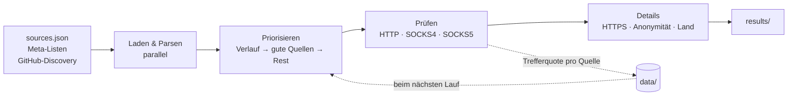

<div align="center">

# proxy-scraper

**Sammelt öffentliche HTTP-, SOCKS4- und SOCKS5-Proxys aus über 700 Quellen, prüft sie parallel und merkt sich, welche Quellen wirklich etwas taugen.**

[](https://github.com/maximilianfeix/proxy-scraper/actions/workflows/tests.yml)


[](LICENSE)


</div>

---

Die meisten freien Proxy-Listen sind zu 95 % tot. Statt stumpf alles durchzuprobieren, lernt das Tool bei jedem Lauf dazu: Proxys, die schon einmal funktioniert haben, kommen zuerst dran, danach die aus Quellen mit guter Trefferquote. Tote oder nicht mehr gepflegte Listen fliegen automatisch raus, und neue Listen findet es selbst auf GitHub.

## Features

- **~1 Mio. Kandidaten in ~25 s** – über 700 Quellen werden parallel geladen, große Listen auf allen CPU-Kernen geparst
- **Eigene Protokoll-Handshakes** für HTTP, SOCKS4 und SOCKS5 direkt auf `asyncio`, kein HTTP-Client-Overhead, 2000+ Prüfungen gleichzeitig
- **Detailprüfung** für jeden Treffer
  - HTTPS-fähig? (Tunnel + verifiziertes TLS – Proxys, die TLS aufbrechen, fallen durch)
  - Anonymität: `elite`, `anonymous` oder `transparent`
  - Land der Exit-IP
- **Lernende Quellenauswahl** – Trefferquote pro Quelle, Verlauf funktionierender Proxys, automatisches Aussortieren toter und veralteter Listen
- **Findet neue Quellen selbst** über die GitHub-API und fremd gepflegte Quellenlisten
- **Filter** nach Land, HTTPS, Anonymität und Latenz, dazu `--want N` zum Stoppen, sobald genug gefunden sind
- **Ergebnisse** als `typ://ip:port`, pro Protokoll als `ip:port`, als JSON und CSV
- Erkennt, wenn eine Firewall Proxy-Verbindungen blockiert, statt still leere Dateien zu schreiben

## Schnellstart

```bash
git clone https://github.com/maximilianfeix/proxy-scraper.git
cd proxy-scraper
pip install -r requirements.txt

python3 proxy_scraper.py
```

Braucht nur Python 3.9+ und [`rich`](https://github.com/Textualize/rich). `uvloop` ist optional und macht die Event-Loop noch etwas schneller.

## Beispiele

```bash
# 50 Proxys, die HTTPS können – danach Schluss
python3 proxy_scraper.py --want 50 --https-only

# nur aus Deutschland, Österreich und der Schweiz, die 20.000 vielversprechendsten Kandidaten
python3 proxy_scraper.py --country DE,AT,CH -l 20000

# schnelle Elite-SOCKS5-Proxys
python3 proxy_scraper.py --types socks5 --anonymity elite --max-latency 1500

# nur die Treffer vom letzten Mal (plus Verlauf) neu prüfen – dauert Sekunden
python3 proxy_scraper.py --recheck

# welche Quellen liefern am meisten?
python3 proxy_scraper.py --list-sources
```

Mit <kbd>Strg</kbd>+<kbd>C</kbd> lässt sich jederzeit abbrechen – alles bis dahin Gefundene wird gespeichert.

## So funktioniert's



1. **Quellen** – die kuratierte Liste in [`sources.json`](sources.json), dazu Meta-Quellen (andere Projekte, die selbst Listen von Proxy-Quellen pflegen) und alle drei Tage eine Suche auf GitHub nach aktiv gepflegten Proxy-Listen-Repos.
2. **Sammeln** – Text, HTML-Tabellen, JSON-APIs und `typ://ip:port`-Zeilen werden erkannt. Private und reservierte Adressbereiche werden verworfen.
3. **Priorisieren** – bekannte funktionierende Proxys zuerst, dann nach gelernter Trefferquote ihrer Quellen. Mit `-l` bekommt man so die besten *N* statt irgendwelcher *N*.
4. **Prüfen** – jeder Proxy muss `checkip.amazonaws.com` abrufen und eine gültige, fremde IP zurückliefern. Wer die eigene IP durchreicht, fliegt raus.
5. **Lernen** – Trefferquoten pro Quelle und der Verlauf landen in `data/`. Quellen ohne einen einzigen Treffer, mit seit einer Woche unverändertem Inhalt oder dauerhaft nicht erreichbar werden übersprungen (`--all-sources` erzwingt sie trotzdem).

<details>
<summary><b>Abschlussbericht ansehen</b></summary>
<br>

</details>

## Ausgabe

Jeder Lauf bekommt einen eigenen Ordner, `results/latest` zeigt immer auf den neuesten:

```
results/2026-09-24_18-42-07/
├── all.txt        socks5://203.0.113.10:1080   (schnellste zuerst)
├── http.txt       203.0.113.20:8080            (reine ip:port-Listen pro Typ)
├── socks4.txt
├── socks5.txt
├── proxies.json   Latenz, Land, HTTPS, Anonymität, Exit-IP
└── proxies.csv
```

## Optionen

| Option | Beschreibung |
|---|---|
| `--types http socks5` | nur bestimmte Protokolle |
| `-l`, `--limit N` | nur die *N* vielversprechendsten Proxys prüfen |
| `--want N` | beenden, sobald *N* passende Proxys gefunden sind |
| `--country DE,AT` | nur diese Länder |
| `--https-only` | nur Proxys, die HTTPS tunneln können |
| `--anonymity elite` | Mindest-Anonymität (`anonymous` oder `elite`) |
| `--max-latency MS` | maximale Latenz |
| `--recheck [DATEI]` | nur Proxys aus einer Datei bzw. vom letzten Lauf prüfen |
| `--fast` | ohne HTTPS- und Anonymitätstest |
| `--no-geo` | ohne Länder-Lookup |
| `-c`, `--concurrency N` | gleichzeitige Prüfungen (Standard: 2000) |
| `-t`, `--timeout S` | Timeout pro Proxy (Standard: 8 s) |
| `--discover` | sofort neue Quellen auf GitHub suchen |
| `--list-sources [N]` | Rangliste der Quellen anzeigen |
| `-o DATEI` | zusätzlich alle Treffer in diese Datei schreiben |

Alle Optionen: `python3 proxy_scraper.py --help`

> [!TIP]
> Für die GitHub-Suche reicht ein eingeloggtes [`gh`](https://cli.github.com/) oder die Umgebungsvariable `GITHUB_TOKEN`. Ohne Token gilt das API-Limit von 60 Anfragen pro Stunde, dann werden nur 40 Repos durchsucht.

## Quellen

Die kuratierte Liste enthält gut 300 Listen, die alle in den letzten Tagen aktualisiert wurden – reine Spiegel anderer Listen sind rausgefiltert. Eine gute Quelle fehlt? Einfach in `sources.json` eintragen (Schlüssel `http`, `socks4`, `socks5` oder `auto` für Listen mit `typ://`-Präfix) oder [ein Issue aufmachen](../../issues/new?template=new_source.md).

## Probleme

**Es kommt (fast) nichts durch.** Viele Firmen-, Schul- und Uni-Netze blockieren Proxy-Verbindungen. Das Tool erkennt das an einer Trefferquote unter 0,2 % und warnt dann – in dem Fall hilft ein anderes Netz, z. B. ein Handy-Hotspot. Die gelernten Statistiken werden bei so einem Lauf nicht abgewertet.

**Windows** wird aktuell nicht unterstützt (das `resource`-Modul fehlt dort), siehe Issues.

## Entwicklung

```bash
pip install pytest
python3 -m pytest
```

Die Tests laufen ohne Internet – für die Handshakes starten sie kleine Fake-Proxys auf `localhost`.

```
proxy_scraper.py       Einstiegspunkt
proxyscraper/
├── cli.py             Optionen und Gesamtablauf
├── pipeline.py        Quellen sammeln, priorisieren, Prüfschleife
├── checker.py         HTTP/SOCKS-Handshakes, HTTPS- und Anonymitätstest
├── sources.py         Quellenlisten, Meta-Quellen, GitHub-Discovery, Statistik
├── parsing.py         Proxys in Text, HTML und JSON finden
├── history.py         Verlauf funktionierender Proxys
├── geo.py             Länder über ip-api.com (Batch, mit Cache)
├── output.py          Filter und Ergebnisdateien
├── netio.py           schlanker HTTP-Client auf asyncio
└── ui.py              Terminal-Oberfläche
```

## Hinweis

Öffentliche Proxys werden von Unbekannten betrieben, die alles mitlesen können, was unverschlüsselt durchgeht. Keine Passwörter oder persönlichen Daten darüber schicken und nur für legale Zwecke nutzen.

## Lizenz

[MIT](LICENSE)
