<div align="center">

<picture>
  <source media="(prefers-color-scheme: dark)" srcset="docs/banner-dark.svg">
  <source media="(prefers-color-scheme: light)" srcset="docs/banner-light.svg">
  
</picture>

[](https://github.com/maximilianfeix/proxy-scraper/actions/workflows/tests.yml)
[](https://github.com/maximilianfeix/proxy-scraper/releases/latest)
[](#live-list)
[](https://pypi.org/project/proxy-scraper-cli/)
[](https://pepy.tech/projects/proxy-scraper-cli)
[](https://github.com/maximilianfeix/proxy-scraper/stargazers)
[](LICENSE)

[English](README.md) · **简体中文**

[安装](#install) · [每小时更新的代理列表](#live-list) · [代理池 API（兼容 proxy_pool）](#pool-api) · [轮换代理服务器](#proxy-server) · [Python](#python) · [AI 智能体（MCP）](#mcp) · [常见问题](#faq)

</div>

---

大多数免费代理列表里 95% 的代理已经失效，剩下的还有不少是蜜罐，或者会往你的网页里注入脚本。**proxy-scraper** 从 700 多个公开来源收集 HTTP、SOCKS4 和 SOCKS5 代理，只保留通过全部检测的那些。它每次运行都会学习哪些来源值得抓取，还能把结果变成一个本地轮换代理。

**数据说话：** 一天内检测了 360 万个免费代理，只有 1.1% 真正可用；首次请求有响应的代理中，54% 在第二次请求时失败，约每 40 个可用代理就有 1 个会篡改网页内容。[详细数据（英文）→](docs/free-proxies-in-numbers.md)

**谁在用：** 每小时更新的列表是 [monosans/proxy-scraper-checker](https://github.com/monosans/proxy-scraper-checker) 和 [gfpcom/free-proxy-list](https://github.com/gfpcom/free-proxy-list) 的内置数据源。

**无需安装，大约五秒即可试用：**

```bash
uvx proxy-scraper-cli --pick 5 --types socks5     # 5 个已验证的代理

# 或者直接下载列表
curl -s https://maximilianfeix.github.io/proxy-scraper/socks5.txt | head
```

<div align="center">

</div>

## 每个代理都要通过的检测

| 检测 | 说明 |
|---|---|
| 真实握手 | 代理必须真正完成 HTTP / SOCKS4 / SOCKS5 协议握手 |
| 两个独立站点，同一出口 IP | 第二次独立请求必须返回同一个出口 IP——只应答扫描器的蜜罐会在这里被淘汰 |
| 内容未被篡改 | 已知页面必须逐字节一致，注入脚本或广告的代理会被丢弃 |
| HTTPS 使用经过验证的 TLS | 只有证书校验通过的代理才会被标记为支持 HTTPS |
| 详细信息 | 匿名级别（elite / anonymous / transparent）、国家、ASN 和运营商、是否为数据中心、延迟、下载速度 |

<a id="install"></a>

## 安装

```bash
pipx install proxy-scraper-cli
proxy-scraper
```

PyPI 上的包名是 `proxy-scraper-cli`，命令是 `proxy-scraper`。支持 Python 3.9–3.13，macOS、Linux 和 Windows 均可运行，只依赖 `rich` 和 `certifi`。

macOS 和 Linux 也可以用 [Homebrew](https://brew.sh) 安装：

```bash
brew install maximilianfeix/tap/proxy-scraper
```

在国内下载较慢时，可以使用 PyPI 镜像：

```bash
pip install -i https://pypi.tuna.tsinghua.edu.cn/simple proxy-scraper-cli
```

也可以用 Docker（`linux/amd64` 和 `linux/arm64`）：

```bash
docker run --rm ghcr.io/maximilianfeix/proxy-scraper --want 50 --https-only
```

不带参数运行时会出现一个设置向导，用方向键选择预设（全部协议、网页浏览、最高匿名、快速稳定……），最后会显示对应的命令行。

<a id="live-list"></a>

## 每小时更新的代理列表

不想自己扫描？GitHub Actions 每小时运行一次本工具并发布结果。列表中的每个代理在上一次运行中都通过了全部检测，按「最优优先」排序：加载网页快、并且很可能仍然在线的排在最前面（已连续在线一天的代理，一小时后仍可用的比例为 99%；新出现的只有 25%）。

- **网页版**（可按协议、国家、HTTPS、运营商、延迟筛选）：https://maximilianfeix.github.io/proxy-scraper/
- **纯列表仓库**（按协议、按国家、按网站分类的 TXT，以及 JSON / CSV）：[maximilianfeix/free-proxy-list](https://github.com/maximilianfeix/free-proxy-list)

| 列表 | 格式 | 地址 |
|---|---|---|
| 全部 | `socks5://1.2.3.4:1080` | `https://maximilianfeix.github.io/proxy-scraper/all.txt` |
| HTTP · SOCKS4 · SOCKS5 | `1.2.3.4:8080` | `…/http.txt` · `…/socks4.txt` · `…/socks5.txt` |
| 支持 HTTPS | `type://ip:port` | `…/https.txt` |
| 高匿（elite） | `type://ip:port` | `…/elite.txt` |
| 稳定（本周 90% 以上的运行中都在列表里） | `type://ip:port` | `…/stable.txt` |
| 完整信息 | 延迟、国家、HTTPS、匿名级别、出口 IP、在线率 | `…/proxies.json` · `…/proxies.csv` |

```bash
curl -s https://maximilianfeix.github.io/proxy-scraper/socks5.txt | head
```

> [!TIP]
> 如果 `raw.githubusercontent.com` 访问不稳定，优先使用上面的 **GitHub Pages** 地址（有 CDN、支持 CORS）。也可以用 jsDelivr：`https://cdn.jsdelivr.net/gh/maximilianfeix/proxy-scraper@proxy-list/socks5.txt`（可能会延迟几个小时）。

这些代理是从 GitHub 位于美国的服务器上检测的。`proxy-scraper --recheck live` 会下载列表并从**你自己的网络**重新检测一遍，大约 30 秒。

<a id="pool-api"></a>

## 代理池 API：可直接替换 jhao104/proxy_pool

用过 [jhao104/proxy_pool](https://github.com/jhao104/proxy_pool)？proxy-scraper 的接口、`type=https` 参数和 JSON 字段（`proxy`、`https`、`region`、`anonymous`、`check_count`、`fail_count` 等）与它相同，只需把代码指向 8899 端口即可继续使用——**不需要 Redis**，而且每个代理都通过了蜜罐和篡改检测，标记为支持 HTTPS 的代理还通过了 TLS 验证。

```bash
proxy-scraper --recheck live --serve   # 从每小时列表开始，约 30 秒后可用
```

```bash
curl http://127.0.0.1:8899/get                                    # 一个代理（JSON）
curl "http://127.0.0.1:8899/get?country=DE&https=1&format=txt"    # → http://203.0.113.7:8080
curl "http://127.0.0.1:8899/all?protocol=socks5&limit=20"         # 最优的 20 个 SOCKS5 代理
curl "http://127.0.0.1:8899/report?proxy=203.0.113.7:8080&ok=0"   # 反馈失败，连续三次后移出代理池
```

| 接口 | 作用 |
|---|---|
| `/get` | 按 `--rotate` 策略选一个代理 |
| `/pop` | 同 `/get`，并把该代理移出代理池 |
| `/all` | 所有可用代理，最优优先（`limit=N`） |
| `/count` | 按类型和国家统计 |
| `/delete?proxy=IP:PORT` | 移除一个代理 |
| `/report?proxy=IP:PORT&ok=0` | 反馈你自己请求的结果 |

`/get`、`/pop` 和 `/all` 支持筛选：`country=DE,AT`、`protocol=socks5`、`https=1`、`anonymity=elite`、`max_latency=1500`，以及 `format=txt` 返回纯文本 URL。

```python
import requests
proxy = requests.get("http://127.0.0.1:8899/get?type=https").json()["url"]   # 例如 socks5://…，已包含类型
requests.get("https://example.com", proxies={"http": proxy, "https": proxy})
```

<a id="proxy-server"></a>

## 轮换代理服务器

同一个端口也是一个本地代理：每个连接都会走不同的代理，失败时自动切换到下一个。

```bash
curl -x http://127.0.0.1:8899 https://api.ipify.org                  # 每次都是不同的 IP
curl -x socks5h://127.0.0.1:8899 https://api.ipify.org               # 同一端口也支持 SOCKS5
curl -x http://country-us:x@127.0.0.1:8899 https://api.ipify.org     # 只用美国出口
curl -x http://session-cart42:x@127.0.0.1:8899 https://shop.example  # 同一会话保持同一个代理
```

和商业轮换代理一样，通过**用户名**指定需求：`country-XX`、`type-http|socks4|socks5`、`session-名称`，可以组合使用。HTTPS 优先使用 TLS 验证通过的代理；如果当前没有合适的已验证代理（没有符合需求的，例如 `country-de`，或者它们都已被移出轮换），则使用其他代理——客户端自己的证书校验仍然有效，请不要关闭；连续失败三次的代理会被移出轮换，之后定期重新检测。默认只监听 `127.0.0.1`；如需对外开放，请用 `PROXY_SCRAPER_SERVE_PASSWORD` 设置密码。更多选项见[英文文档](README.md#proxy-server)。

<a id="python"></a>

## 在 Python 中使用

```python
from proxyscraper import ProxyRotator, live_proxies

# 每小时列表，不做检测，约一秒返回
proxies = live_proxies(types=["socks5"], https=True, min_uptime=90)

# 自动重试和切换代理
with ProxyRotator(country="US") as rotator:
    r = rotator.get("https://httpbin.org/ip")
    print(r.status, r.text, "via", r.via)

# 给 requests / httpx / Playwright / Scrapy 用的本地轮换代理地址
with ProxyRotator() as rotator:
    proxy = rotator.proxy_url()
```

需要从自己的网络重新检测时，使用 `find_proxies()` 和 `check_proxies()`。完整说明见[英文文档](README.md#from-python)。

## 常用命令

```bash
proxy-scraper --want 50 --https-only                   # 找到 50 个支持 HTTPS 的代理后停止
proxy-scraper --types socks5 --anonymity elite         # 高匿 SOCKS5
proxy-scraper --country US,JP,SG --max-latency 1500    # 指定国家和最大延迟
proxy-scraper --target www.google.com --want 20        # 只保留能访问目标网站的代理
proxy-scraper --pick 5 --types socks5                  # 直接从每小时列表取 5 个，不扫描
proxy-scraper --export clash                           # 导出 Clash 配置（也支持 proxychains、sing-box、curl）
```

全部选项：`proxy-scraper --help`，或查看[英文文档](README.md#options)。

<a id="mcp"></a>

## AI 智能体（MCP）

`proxy-scraper-mcp` 是一个 [MCP](https://modelcontextprotocol.io) 服务器：Claude Code、Claude Desktop、Cursor、VS Code 等客户端可以获取可用代理，并通过它们加载网页。

```json
{
  "mcpServers": {
    "proxy-scraper": {
      "command": "uvx",
      "args": ["--python", ">=3.10", "--from", "proxy-scraper-cli[mcp]", "proxy-scraper-mcp"]
    }
  }
}
```

不想装 Python？用 Docker 镜像（已包含所有依赖）：`"command": "docker"`，`"args": ["run", "-i", "--rm", "ghcr.io/maximilianfeix/proxy-scraper", "--mcp"]`。

<a id="faq"></a>

## 常见问题

**谁在运行免费代理？可以放心使用吗？**
几乎没有人是专门为你提供的。公开列表上的代理通常是：配置错误、端口意外开放的服务器；少数有意开放的代理；被感染而主人并不知情的电脑和物联网设备；以及记录流量或篡改网页的陷阱。proxy-scraper 无法区分被感染的家用路由器和开放的办公代理，但会过滤可测量的风险：两次独立请求必须得到相同的出口 IP（只应答扫描器的蜜罐会被淘汰），已知页面必须逐字节一致（注入脚本的会被淘汰），HTTPS 只在证书端到端验证通过时才算数。适合公开数据、查看其他国家的网站效果、测试自己的封禁规则和科研；绝不要通过免费代理发送密码、Cookie、支付或个人信息。

**为什么比其他列表的代理少？**
因为只保留通过全部检测的代理。很多列表把能建立 TCP 连接的都算进去；这里代理必须加载两个独立页面并显示外部 IP。通常一百万个候选里只有几百到几千个——但它们是真的能用。

**几乎什么都检测不通过？**
很多公司、学校和部分网络环境会拦截代理连接。工具在命中率低于 0.2% 时会给出提示，换一个网络（例如手机热点）通常有帮助。

**免费代理安全吗？**
免费代理由陌生人运营，请视为不可信。不要通过它们发送密码或个人信息。列表中的代理都通过了内容篡改检测，HTTPS 代理的 TLS 经过端到端验证，适合抓取公开页面或查看其他国家的网站，不适合网银等敏感操作。

**列表多久更新一次？**
每小时一次。免费代理变化很快，重要场景请在使用前运行 `proxy-scraper --recheck`。

## 参与贡献

欢迎提交 Issue 和 Pull Request（中文或英文都可以）。Hacktoberfest 期间有一些[适合新手的 Issue](https://github.com/maximilianfeix/proxy-scraper/issues?q=is%3Aopen+label%3Ahacktoberfest)。如果这个项目对你有帮助，欢迎点一个 ⭐。

## 免责声明

本工具只使用公开的代理列表。请遵守当地法律法规以及你所访问网站的使用条款，仅将代理用于合法用途。项目采用 [MIT 许可证](LICENSE)。
