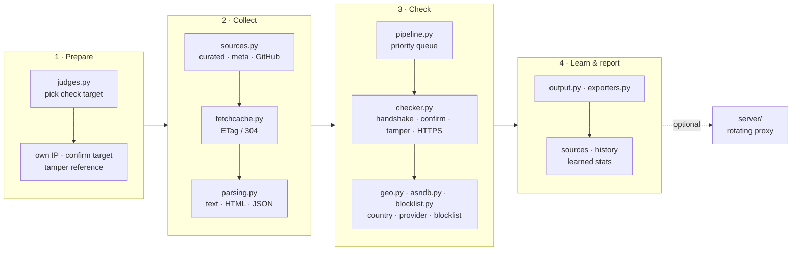
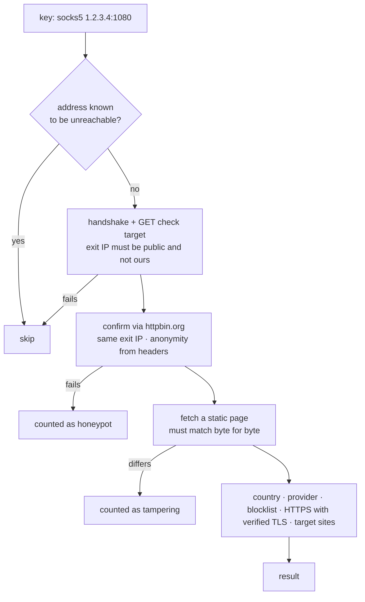
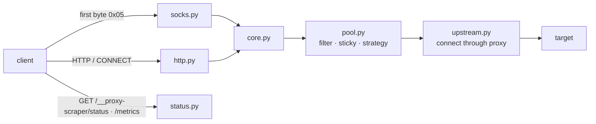
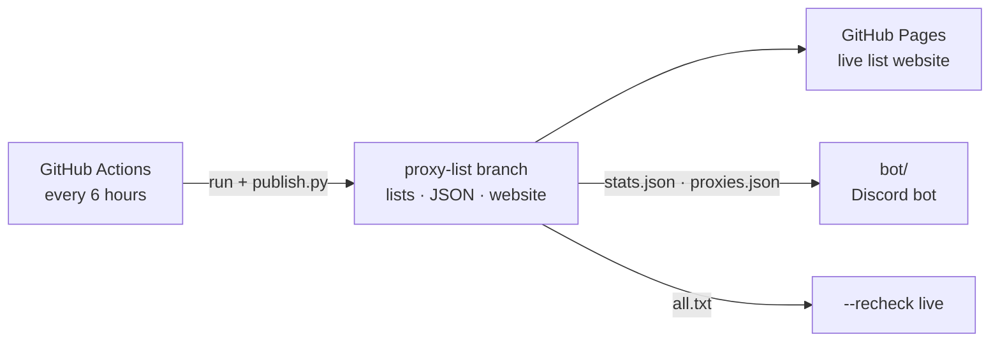

# Architecture

How proxy-scraper is put together, and why some things are the way they are. If you want to change something, this is the map.

## The big picture

A run has four phases. `app.py` drives them, everything else is a module that does one job.

## Modules

| Module | Job |
|---|---|
| `cli.py` | arguments, wizard or direct start |
| `options.py` | `RunOptions` and `Filters` – every setting in one object, round-trips to argv |
| `app.py` | one run in phases, the only place that knows the order of things |
| `sources.py` | source lists, meta sources, GitHub discovery, per-source hit statistics |
| `fetchcache.py` | conditional downloads; parsed keys of unchanged lists come from `data/fetch-cache` |
| `parsing.py` | finds proxies in any format, drops private/reserved ranges, keys are `"type ip:port"` strings |
| `pipeline.py` | collect in parallel (process pool for big lists), prioritise, run the check workers |
| `checker.py` | the checks themselves, see below |
| `handshake.py` | HTTP/SOCKS4/SOCKS5 handshakes including login, shared by checker and server |
| `judges.py` | check targets, Cloudflare filter, failover while running |
| `geo.py` · `geodb.py` · `asndb.py` | countries and providers, offline from DB-IP, ip-api.com as fallback |
| `blocklist.py` | is the exit IP on SpamCop? One cached DNS lookup per IP, skipped when the resolver is refused |
| `targets.py` | target sites for `--target` |
| `completion.py` | bash/zsh/fish completion, generated from the argparse parser so it can't go stale |
| `history.py` | which proxies worked before – they are checked first next time |
| `output.py` · `exporters.py` · `publish.py` | result files, proxychains/Clash/curl configs, the live list and its website |
| `site/` | the live list website (one static `index.html` plus images), published next to the JSON files |
| `server/` | the rotating proxy server (`--serve`) |
| `api.py` | `find_proxies()` / `check_proxies()` for use from Python |
| `ui/` | everything that draws: widgets, dashboard, report, wizard, server view |

`ui/` only draws. It never decides anything, and during a run nothing outside `ui/` prints directly – all output goes through `widgets.console`, which is also how the tests and the Python API silence it. (`publish.py` is the exception: it runs in GitHub Actions and just prints status lines.)

## What happens to one proxy

Only hits go through the later steps, so the expensive checks cost little. Every failure still counts for the source it came from, that's what the learning is built on. A hit is only recorded once its verdict is in: when `--want` or Ctrl+C stops the workers, proxies still being confirmed are neither working nor failed.

## The proxy server

The first packet of every connection is kept, so if a proxy stays silent or answers with garbage, the same packet goes to the next one without the client noticing. Upstream answers are screened until the final status line, so a proxy asking for a login (407) never reaches the client.

Failures come in three kinds. A proxy that doesn't answer, times out or speaks garbage counts against it right away. A proxy that answers but can't open the tunnel (CONNECT 502, SOCKS refusal) raises `TargetError`: that only counts against it if another proxy then reaches the same target, so a dead target never disables the pool. `Unsupported` (SOCKS4 and IPv6) never counts.

## Around the tool

`bot/` is a separate package with its own requirements (discord.py). It only reads the published JSON files, so it knows nothing about the tool's internals. `.github/workflows/bot.yml` tests it and deploys it to a server over SSH.

## State on disk

| Where | What |
|---|---|
| `data/source_stats.json` | hit rate per source, last change, fail streak |
| `data/proxy_history.json` | proxies that worked, with latency and details |
| `data/fetch-cache/` | ETags and parsed keys of the lists (gzip) |
| `data/geo/` | DB-IP country and provider databases, refreshed monthly |
| `results/<date>/` | one folder per run, `results/latest.txt` points to the newest |

Installed with pip/pipx, `data/` lives in the user data folder (`PROXY_SCRAPER_HOME` overrides it) and `results/` in the current directory.

## Decisions we measured

Some things look like obvious improvements and turned out not to be. The numbers are in the linked issues.

- **Protocol detection before checking** ([#3](../../../issues/3)) – a third of the addresses are listed under all three types, but sniffing the protocol with an extra connection made runs slower (77 s vs 60 s). Dropped.
- **IPv6** ([#1](../../../issues/1)) – about 300 entries across all 726 sources, mostly V2Ray configs. Not worth it yet.
- **Check targets are ranked by quality, not latency** ([#8](../../../issues/8)) – the same 300 proxies found 255 hits through checkip.amazonaws.com but only 199 through ident.me, although ident.me answered faster.
- **Tamper check** ([#46](../../../issues/46)) – one in five working proxies injected something into a plain HTML page. That's why it's always on.
- **Cloudflare is never a check target** – many "proxies" are Cloudflare addresses that would answer a request to a Cloudflare-hosted site themselves.
- **Blocklists** ([#66](../../../issues/66)) – Spamhaus refuses public resolvers, DroneBL lists 59 % of exit IPs (it's essentially a list of open proxies), SpamCop lists 29 %. Only SpamCop is used, and only after a probe with the documented test address proves the resolver gets real answers.

## Testing

Everything runs offline: `tests/fakes.py` has real HTTP, SOCKS4 and SOCKS5 proxies, honeypots, login-protected proxies and target sites on `localhost`. Network code is tested against those, not against mocks of our own functions. CI runs the suite on Linux, macOS and Windows with Python 3.9, 3.11 and 3.13, builds the package, and does a real scan inside the Docker image.
